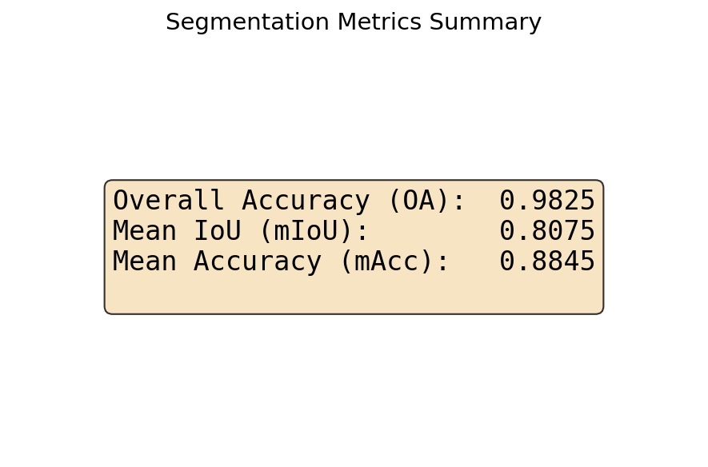
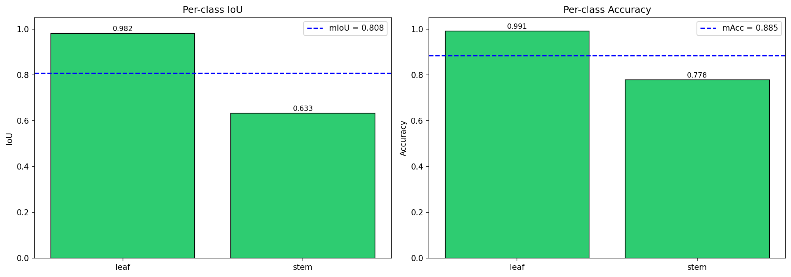
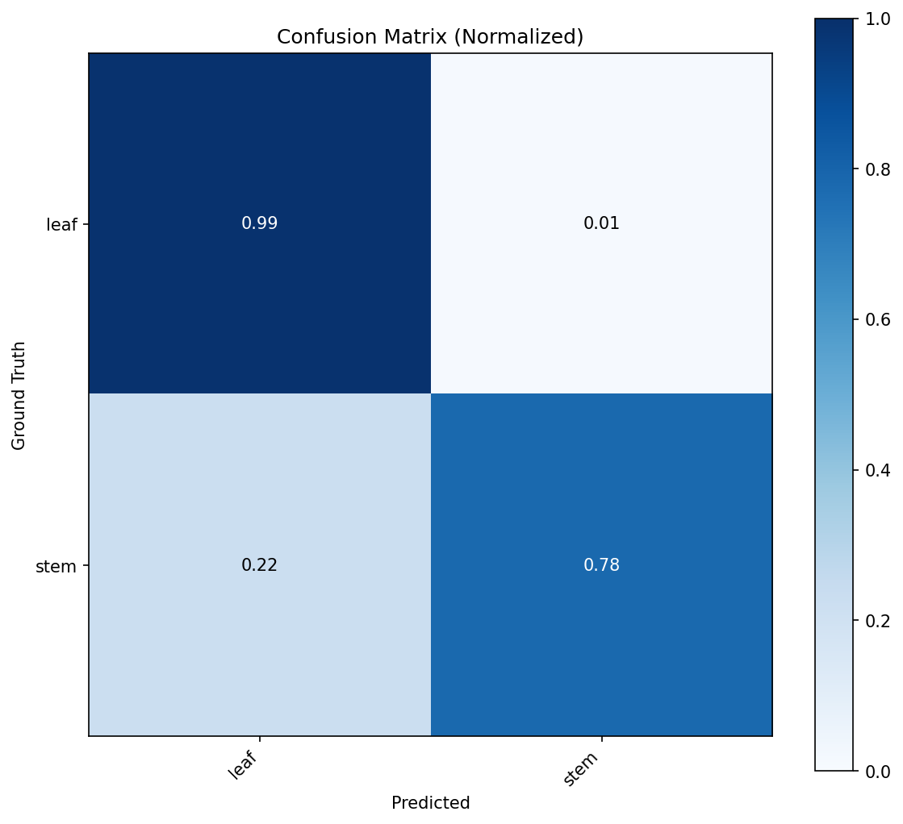
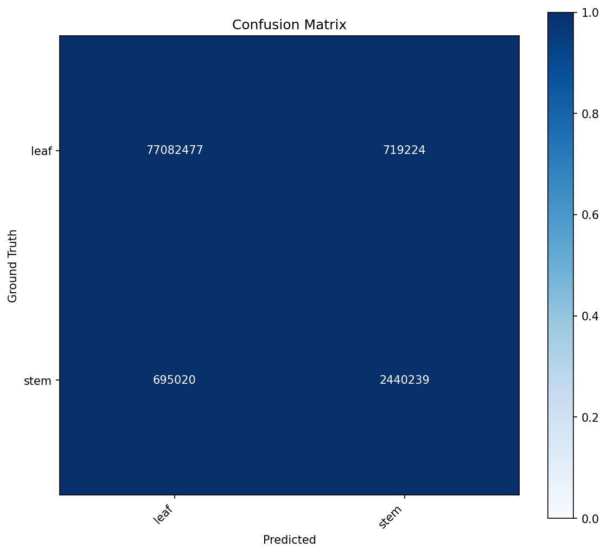
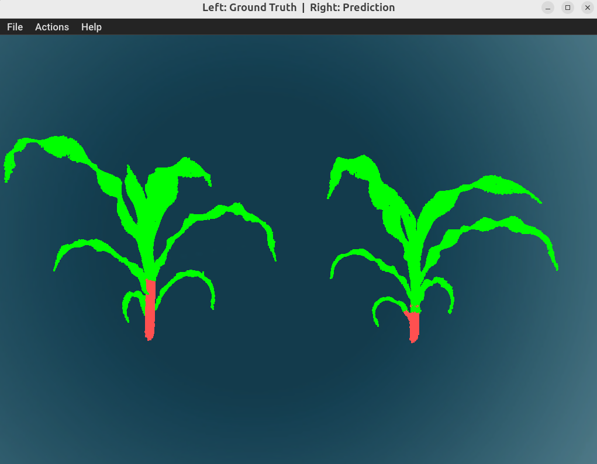
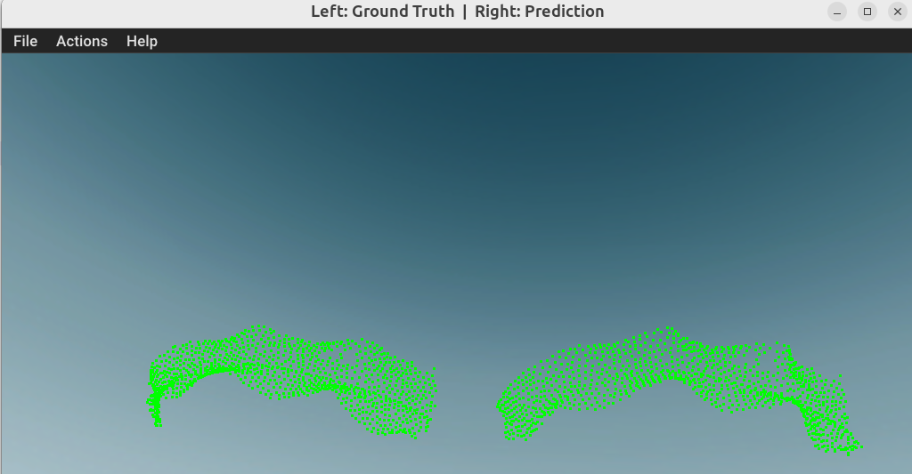

# 🌽 3D Point Cloud Semantic Segmentation for Maize Phenotyping

Point-level semantic segmentation (leaf/stem) of maize point clouds using PointNet++ for automated phenotypic trait extraction. Built on the SYAU Maize Stem-Leaf dataset (428 plants, 5 varieties), covering data preprocessing, training, evaluation, 3D visualization, and phenotype parameter estimation.

## Results

| Metric | Value |
|--------|-------|
| mIoU | **0.840** |
| Overall Accuracy | **0.983** |
| Leaf IoU | 0.984 |
| Stem IoU | 0.696 |

*Validation set metrics at best epoch (65). Test set: mIoU 0.819, stem IoU 0.656.*

## Result Visualization

### Quantitative Metrics

<p align="center">
  
  
</p>

<p align="center">
  
  
</p>

### Prediction vs Ground Truth

<p align="center">
  
</p>

<p align="center">
  
</p>

## Architecture

```
Raw .txt (x, y, z, instance_label)
    │
    ▼
syau_preprocess.py          # Voxel downsample → normalize → block partition → .npz
    │
    ▼
dataset.py                  # Block-level DataLoader with augmentation (supports instance labels)
    │
    ▼
PointNet++ MSG              # Multi-scale grouping backbone → per-point semantic logits
    │
    ▼
evaluate.py                 # mIoU, OA, mAcc, confusion matrix, predictions export
    │
    ├── visualize.py         # Open3D 3D rendering (GT vs Pred, error maps, per-block/per-plant)
    └── extract_phenotype.py # plant_height, stem_diameter, leaf_area, leaf_count, canopy_volume
```

## Project Structure

```
├── src/
│   ├── syau_preprocess.py     # Raw data → processed .npz blocks
│   ├── dataset.py             # PyTorch Dataset + augmentation + instance label support
│   ├── train.py               # Training loop (AMP, gradient accumulation, LR scheduling)
│   ├── evaluate.py            # Evaluation with predictions export (including instance labels)
│   ├── visualize.py           # Open3D 3D visualization (block & whole-plant modes)
│   ├── extract_phenotype.py   # Phenotypic trait computation + DBSCAN leaf clustering
│   ├── models/
│   │   ├── pointnet2.py       # PointNet++ (MSG & SSG variants)
│   │   └── losses.py          # CombinedLoss, FocalLoss, DiceLoss, FocalDiceLoss, DiscriminativeLoss
│   └── utils/
│       ├── config.py          # Dataclass-based configuration
│       ├── metrics.py         # SegmentationMetrics (confusion matrix, mIoU, per-class IoU)
│       └── augment.py         # Point cloud augmentation (scale, rotation, jitter, dropout, flip)
├── syau_single_maize/
│   ├── raw/                   # Raw .txt files + complete/uncomplete splits
│   └── processed/             # Preprocessed .npz blocks (train/val/test)
├── checkpoints_v2/            # Best model checkpoint (weight=2 run)
├── logs_v2/                   # TensorBoard training logs
├── results_v2/                # predictions.npz, test_results.json, phenotypes.json
└── outputs/                   # Visualization figures
```

## Setup

```bash
conda create -n pytorch_gpu python=3.10 -y
conda activate pytorch_gpu

pip install torch torchvision torchaudio --index-url https://download.pytorch.org/whl/cu121
pip install open3d
pip install torch-scatter torch-sparse torch-cluster torch-spline-conv \
  -f https://data.pyg.org/whl/torch-$(python -c "import torch; print(torch.__version__)")+cu$(python -c "import torch; print(torch.version.cuda.replace('.',''))").html
pip install torch-geometric
pip install scikit-learn tqdm tensorboard
```

## Dataset

**SYAU Maize Stem-Leaf** — 428 maize plants from 5 varieties (XY335, LD145, LD502, LD586, LD1281).

| Split | Samples |
|-------|---------|
| Train | ~270 |
| Val | ~35 |
| Test | ~70 + uncomplete samples |

- **Format**: 4-column `x y z instance_label`, where `0=stem`, `1,2,3...=leaf instances`
- **Semantic mapping**: `instance==0 → stem (1)`, `otherwise → leaf (0)`
- **Preprocessing**: voxel downsampling (5mm) → centroid + unit-sphere normalization → sliding-window blocks (0.5m, 0.25m stride) → 8192 points per block

## Usage

### 1. Preprocessing

```bash
python src/syau_preprocess.py \
    --input_dir syau_single_maize/raw \
    --output_dir syau_single_maize/processed
```

### 2. Training

```bash
python src/train.py \
    --data_dir syau_single_maize/processed \
    --checkpoint_dir checkpoints_v2 \
    --log_dir logs_v2
```

Monitor with: `tensorboard --logdir logs_v2/ --port 6006`

Key config in `src/utils/config.py`:
- `class_weights`: `[1.0, 2.0]` (leaf, stem) — stem weight=2 achieved best stem IoU
- `batch_size`: 8, `gradient_accumulation`: 2 → effective 16
- `scheduler`: cosine with 10-epoch warmup, early stopping (patience=30)

### 3. Evaluation

```bash
python src/evaluate.py \
    --checkpoint checkpoints_v2/syau_maize/pointnet2_msg/best_model.pth \
    --save_predictions \
    --output_dir results_v2
```

Outputs: `results_v2/predictions.npz` and `results_v2/test_results.json`.

### 4. Visualization

```bash
# Whole-plant GT vs Prediction (side-by-side)
python src/visualize.py \
    --results_json results_v2/test_results.json \
    --mode whole_plant \
    --sample_idx 0

# List available plants
python src/visualize.py \
    --results_json results_v2/test_results.json \
    --mode list
```

### 5. Phenotype Extraction

```bash
# All plants with DBSCAN leaf clustering
python src/extract_phenotype.py \
    --predictions results_v2/predictions.npz \
    --cluster --eps 0.03 \
    --output results_v2/phenotypes.json
```

Extracted traits:

| Parameter | Method | Unit |
|-----------|--------|------|
| plant_height | Z-axis range | normalized |
| stem_height | Stem point Z range | normalized |
| stem_diameter | Mid-slice convex hull diameter | normalized |
| canopy_volume | 3D convex hull volume | normalized |
| leaf_area | Per-instance convex hull surface area | normalized |
| leaf_count | GT: from original instance labels; Pred: DBSCAN clustering | count |
| stem_ratio | Stem point proportion | ratio |

> All length units are in normalized space (centered + unit-sphere scaled). Multiply by the per-plant `scale_factor` (original max_dist during preprocessing, typically ~150–400) to convert to mm.

## Model Details

**PointNet++ MSG** with multi-scale grouping:

```
SA1: radii=[0.1, 0.2, 0.4], MLPs=[16, 32, 128]
SA2: radii=[0.2, 0.4, 0.8], MLPs=[32, 64, 128]
SA3: radii=[0.4, 0.8, 1.6], MLPs=[64, 128, 256]
SA4: radii=[0.8, 1.6, 3.2], MLPs=[128, 256, 512]
→ 4× Feature Propagation → Conv1d(128→2) semantic head
```

- Input: 8192 points × 3 channels (xyz)
- Loss: `CombinedLoss(CE + Dice)` with class weights [1.0, 2.0]
- GPU: RTX 4070 Super 12GB, batch_size=8

## Known Limitations

**Predicted leaf count**: The current semantic segmentation model classifies all leaf points into a single class. Predicted leaf count relies on DBSCAN spatial clustering to separate individual leaves — this fails when leaves touch or overlap near the stem, resulting in undercounting (e.g., 3 predicted vs 7 ground-truth). Ground-truth leaf count is computed from original instance labels and is accurate.

To fundamentally fix this, an instance segmentation approach is needed (e.g., discriminative loss embedding or PointGroup). See `src/models/losses.py` — the `DiscriminativeLoss` class is already implemented.
